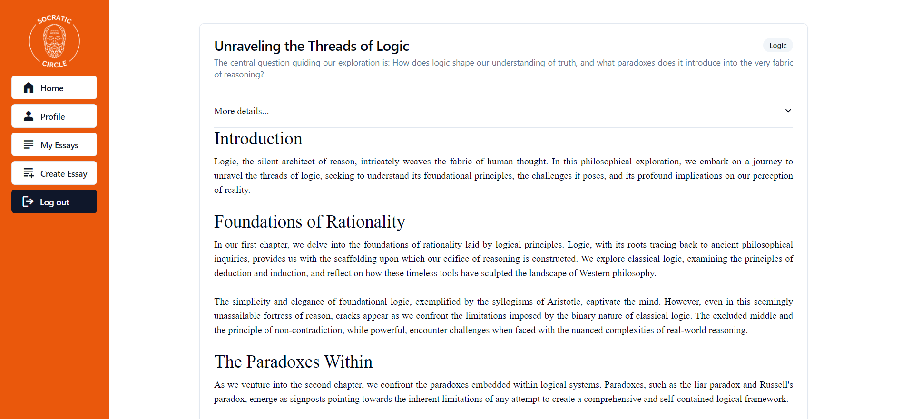
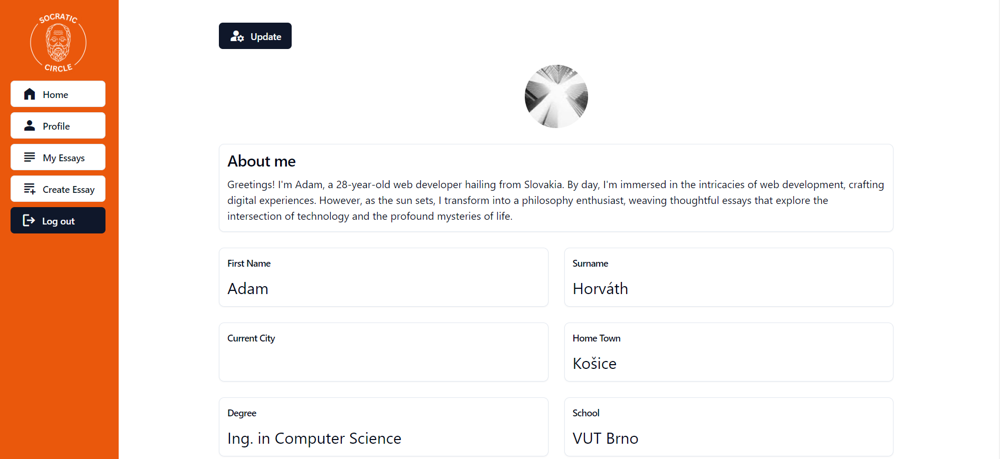
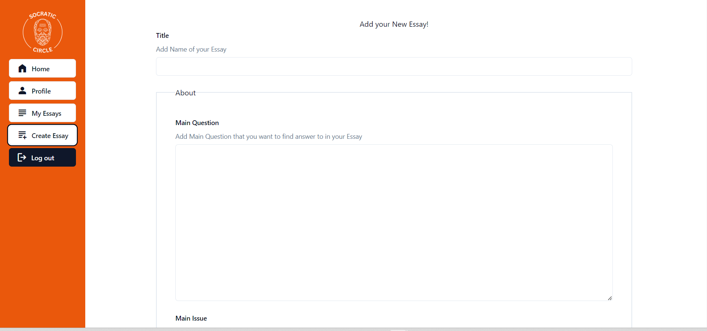

# Socratic-circle

Socratic Circle is a social media website for philosophers to connect and share their work. The back-end runs on Firebase. The project is written in Typescript. I used Redux and the Redux Toolkit for state management. In this project, I learned about CRUD operations as well as how authentication works.

## Screenshots

### Sign in with Gmail


### Browse through or Search essays from other philosophers and learn


### Read them



### See profiles of the users



### Create and share your Essay



```javascript
// Your JavaScript code goes here
function addNumbers(a, b) {
    return a + b;
}

// Example usage
const result = addNumbers(5, 3);
console.log(result); // Output: 8
